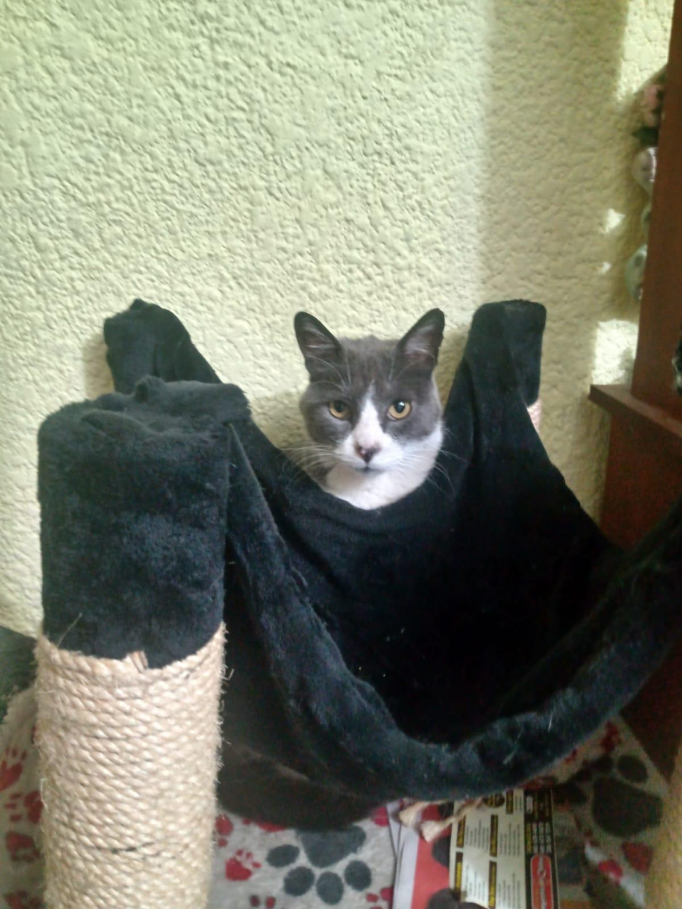
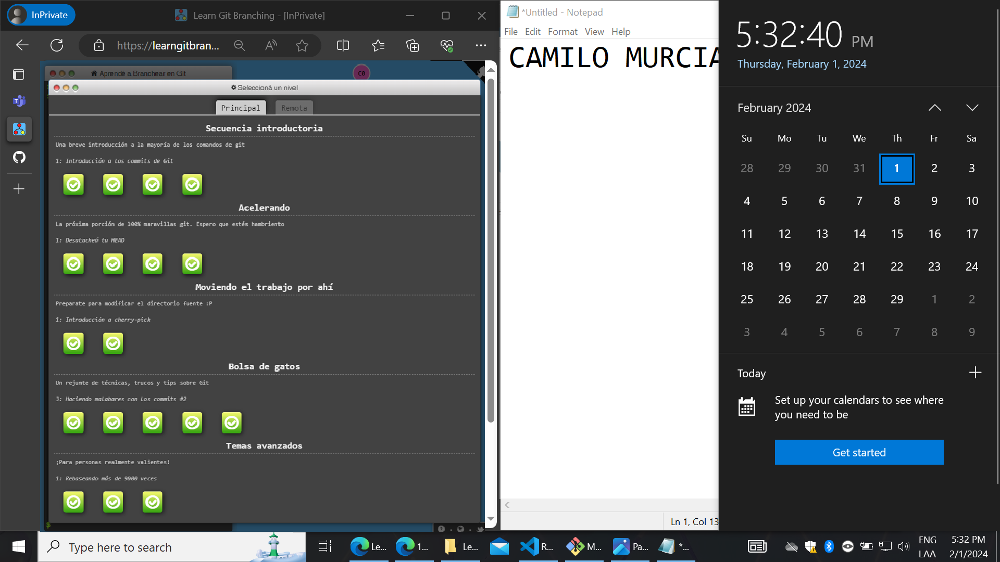
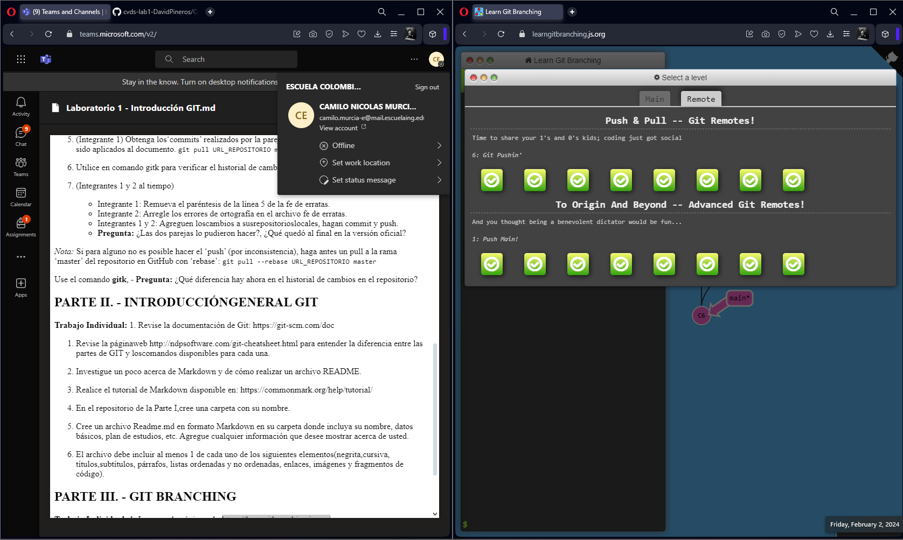

# Laboratorio 1 CVDS 
#
## Por Camilo Nicolas Murcia Espinosa

* Edad 21 años
* 7 semestre
* Ingenieria de _Sistemas_

\
El era mi gato Pancho :c

```
<!DOCTYPE html>
<html lang="es">
<head>
  <meta charset="UTF-8">
  <meta name="viewport" content="width=device-width, initial-scale=1.0">
  <title>Ejemplo de encabezado</title>
</head>
<body>
  <h1>Mi primer encabezado</h1>
  <p>Este es un párrafo de texto.</p>
</body>
</html>
```
### Evidencia 3.



Evidencia de la segunda parte: 




