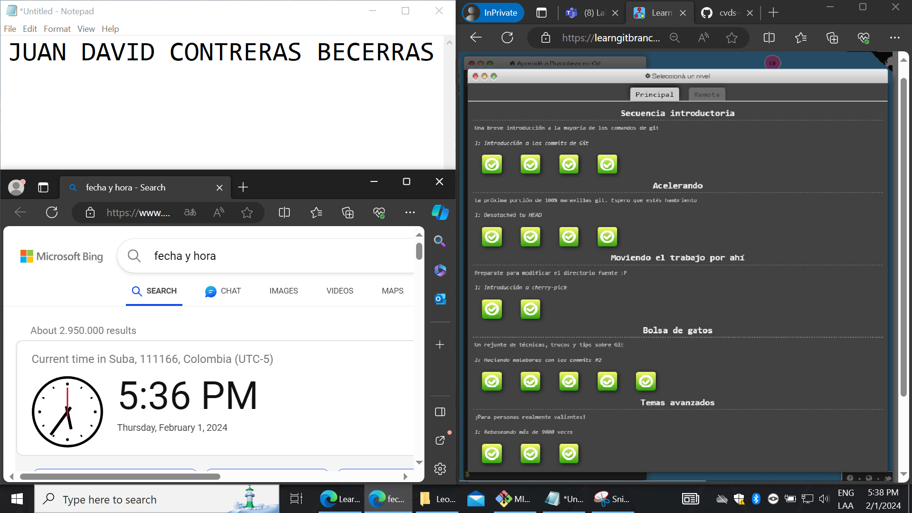

# Laboratorio 1 CVDS 
## Juan David Contreras Becerra

* _Edad *20* años_
* _*7* semestre_
* _Ingenieria de *Sistemas*_

\
Tomado de [Infobae](https://www.infobae.com/colombia/2023/04/27/este-es-el-barrio-mas-cool-de-bogota-segun-la-inteligencia-artificial/)

# Actividades que me gusta hacer:
* Escuchar música
   * No tengo género favorito
* Jugar Videojuegos
   1. Zelda BOTW
   2. Skyrim
   3. GTA V

```
<style>
    .zelda{
        background-color: rgb(12, 183, 242);
        color: black;
        border-color: black;
        height: 50px;
        width: 100px;
        border-radius: 5px;
        border-style: solid;
        cursor: pointer;
        margin-right: 10px;
    }

    .zelda:hover {
        opacity: 0.5;
    }

    .zelda:active {
        opacity: 0.8;
    }

    .skyrim{
        background-color: black;
        color: white;
        border: none;
        height: 35px;
        width: 100px;
        font-weight: bold;
        font-size: 15px;
        border-radius: 17px;
        cursor: pointer;
        margin-left: 10px;
        transition: box-shadow 1s;
    }

    .skyrim:hover {
        box-shadow: 5px 5px 10px rgba(0,0,0, 0.15);
    }

    .skyrim:active{
        opacity: 0.2;
    }

    .gta{
        background-color: rgb(0, 153, 0);
        color: black;
        height: 50px;
        width: 100px;
        cursor: pointer;
    }

    .gta:hover {
        background-color: rgb(8, 8, 184);
        color: white;
    }

    .gta:active{
        opacity: 0.5;
    }
</style>


<button class="zelda">Zelda BOTW</button>
<button class="skyrim">Skyrim</button>
<button class="gta">GTA V</button>
```
## Parte 3

